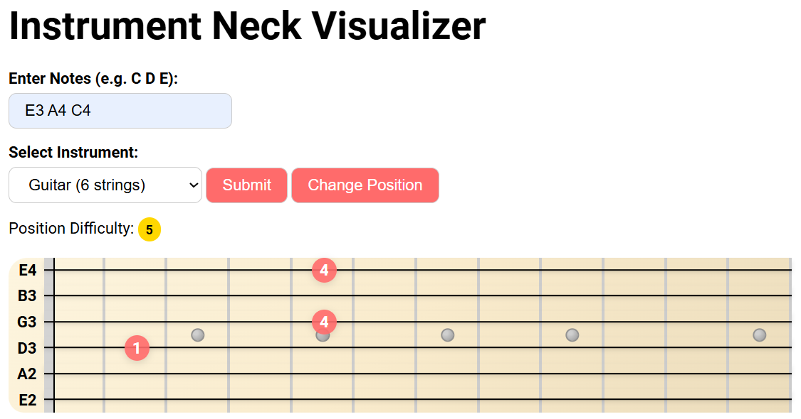

# 🎸 Optimal Musical Fingering

**Optimize chord fingerings and transitions for neck instruments like guitar, ukulele, and more.**

---

## 🎯 Objective

Imagine being able to translate any song into an optimized tablature or partiture, with ideal finger positions chosen automatically. This project aims to make that a reality by calculating **the most efficient and ergonomic placement of fingers on the instrument's neck** for any chord or sequence of chords, for instruments like guitar, ukulele, bass, banjo and others with a similar fretboard layout.

Whether you're practicing or composing, _Optimal Musical Fingering_ helps you play smarter, not harder.

---

## 🚀 Features

✅ **Chord Fingering Optimization**

- Input any chord and get the best possible fingering.
- View all valid positions and fingerings and their visual representation on the instrument's neck.
- Each position includes an evaluation score based on difficulty, playability, and ergonomics.

✅ **Fingering Visualization**

- Chord diagrams display finger positions clearly on the neck, so you can learn and play faster.  
  

🔜 **Upcoming Features**

- **Chord Transition Optimization**: Determine the smoothest transitions between chord fingerings based on finger movement and hand position.
- **Personalized Instrument Profiles**: Customize the algorithm for different neck instruments, accounting for unique fretboard layouts and playing styles.
- **Full Song Analysis**: Input a complete song to receive optimized fingerings and transitions across the entire piece. Output will include a fully playable, optimized tab or partiture.

---

## 🧪 Project Status

The project is currently in early development.  
Implemented so far:

- ✅ Best fingering suggestion for individual chords.
- ✅ Visual switch between all possible fingerings with difficulty evaluation.

---

## 🤝 Contributing

Contributions are very welcome!  
If you have ideas for:

- New features
- Improvements
- Bug fixes

Please open an [issue](https://github.com/eliot-christon/optimal-musical-fingering/issues) or submit a pull request.

---

## 📄 License

This project is licensed under the Apache License 2.0.
See the [LICENSE](LICENSE) file for full details.
